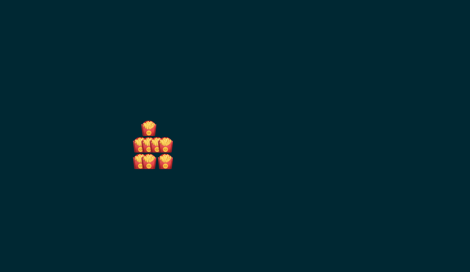

# goboids

<p align="center">
  
  <br><br>
  goboids
  <br><br>
  
</p>

A simulation of [boids](https://en.wikipedia.org/wiki/Boids) that makes swarms of french fries fly in your terminal with über-intelligence. Written in Go.

Why? Because I was on the plane and LLVM takes really long to compile and I've always wanted to do swarm stuff

```
$ go run main.go -h
-alignment float
    The alignment constant (default 0.99)
-bounce float
    The bounce constant, for bouncing off walls (default 4)
-center float
    A constant defining how much to stay around the center (default 0.1)
-cohesion float
    The cohesion constant (default 0.5)
-duration int
    The number of seconds to render (default 10)
-fps int
    The frames to render per second (default 10)
-height int
    The number of lines to use for the screen (default 20)
-perturb float
    The perturbation constant (default 0.15)
-separation float
    The separation constant (default 0.05)
-swarm-size int
    The size of the boid swarm (default 20)
-velocity-clip int
    The maximum velocity (default 10)
-width int
    The number of columns to use for the screen (default 80)
```
